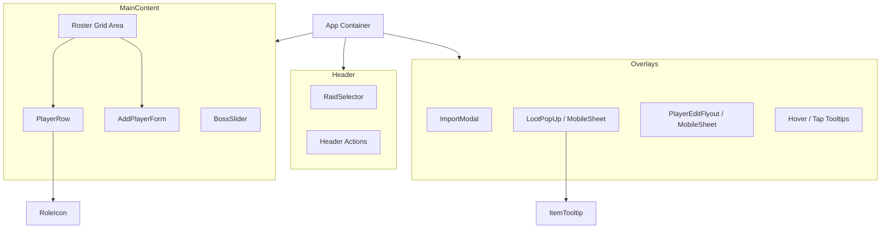

# Technical Design Document: Loot Sheet

## 1. Overview

The Loot Sheet is a Single Page Application (SPA) built with React and Vite. It serves as a visual utility for World of Warcraft raid leaders to track loot distribution during raids. The application emphasizes visual aesthetics (Glassmorphism), interactivity (Framer Motion), speed, and mobile/touch support.

Installable as a PWA on supported browsers; loot tables and app shell cache offline after first load.

## 2. Architecture

`App.jsx` acts as the primary data controller, managing global state (roster, raid/boss context, overlays). Child components are largely stateless or manage transient UI state (hover, mobile sheets, collapse).

### Component Hierarchy Graph

## 3. Data Flow

### 3.1 State Management

The `App.jsx` holds the session source of truth:

*   **`players` (Array)**: Player objects with `id`, `name`, `className`, `role` (`tank` | `healer` | `dps`), and `items`.
*   **`activeRaid` (String)**: Current raid key (e.g. `karazhan`).
*   **`activeBoss` (String)**: Boss or trash loot table id.

### 3.2 Action Flow

1.  **Selection**: User changes raid/boss via `RaidSelector` or `BossSlider`.
2.  **Importing**: `ImportModal` accepts addon export string (`Name:Class|Name:Class`); `parseImportText` in `utils/import-parser.js` sanitizes and validates input.
3.  **Loot Assignment**: User opens loot menu on a row → `LootPopUp` (desktop flyout or mobile bottom sheet) → item assigned to player.
4.  **Mobile**: Tap item icons for tooltips; swipe sheets down to dismiss; collapsible player rows.

## 4. Component Details

### 4.1 Core UX Components

#### `components/PlayerRow.jsx`
*   Renders player name (class colour), role icon, assigned loot icons, edit/add actions.
*   Mobile: collapsible rows, tap-to-preview loot, always-visible edit/remove controls.

#### `components/LootPopUp.jsx`
*   Boss loot picker; desktop positioned popup, mobile `MobileSheet` bottom sheet.
*   Mobile: tap icon to preview item, tap row to assign.

#### `components/PlayerEditFlyout.jsx` / `PlayerEditForm.jsx`
*   Edit name, class, role; delete player. Mobile uses bottom sheet.

#### `components/MobileSheet.jsx`
*   Shared bottom sheet with backdrop, drag-to-dismiss, safe-area padding.

#### `components/AddPlayerForm.jsx`
*   Manual player entry with class and role selectors.

### 4.2 Navigation

#### `components/RaidSelector.jsx` / `components/BossSlider.jsx`
*   Raid and boss/trash selection; horizontal scroll with snap on mobile.

### 4.3 Utility Components

#### `components/ImportModal.jsx` / `components/ExportModal.jsx`
*   Bulk import and spreadsheet export (plain + HTML clipboard).

#### `components/RoleIcon.jsx` / `components/RoleSelector.jsx`
*   Display and edit tank / healer / DPS role.

#### `components/ItemTooltip.jsx`
*   WoW-style item tooltip rendering.

## 5. Data Layer

No backend. Static JSON + client-side state only.

*   `data/raids.json`: Raid → bosses/trash structure.
*   `data/loot.json`: `bossId → Item[]` loot tables.
*   `utils/wow-constants.js`: Class colours, token class helpers.
*   `utils/import-parser.js`: Import sanitization and player factory.
*   `hooks/useIsMobile.js`: Viewport breakpoint hook (`768px`).

## 6. PWA & Offline

*   `vite-plugin-pwa` generates service worker and web manifest.
*   App shell and loot JSON cached on install/first visit.
*   Wowhead item icons cached at runtime (`CacheFirst`).

## 7. Future Extensibility

To add a new raid: extend `raids.json`, generate loot via `scripts/generate-loot.mjs`, redeploy.
