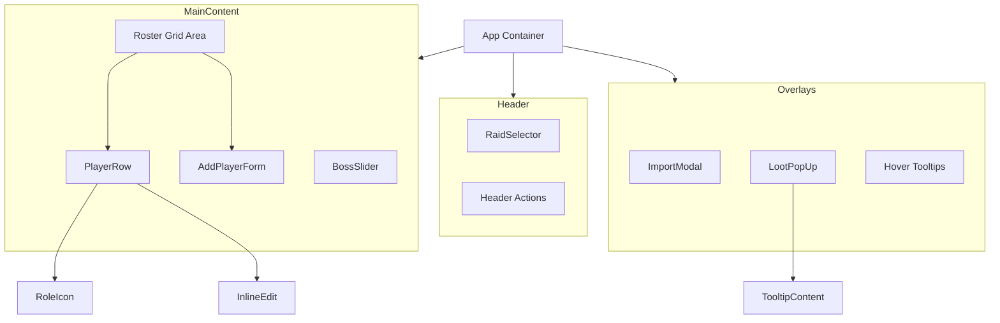

# Technical Design Document: Loot Sheet

## 1. Overview

The Loot Sheet is a Single Page Application (SPA) built with React and Vite. It serves as a visual utility for World of Warcraft raid leaders to track loot distribution during raids. The application emphasizes visual aesthetics (Glassmorphism), interactivity (Framer Motion), and speed.

## 2. Architecture

The application checks the "Container-Presentational" pattern loosely. `App.jsx` acts as the primary data controller, managing the global state (Rostering, Selection), while child components are largely stateless or manage only transient UI state (like hover effects).

### Component Hierarchy Graph

## 3. Data Flow

### 3.1 State Management

The `App.jsx` holds the "Source of Truth" for the session:

*   **`players` (Array)**: The main dataset. A list of player objects containing:
    *   `id`: unique string
    *   `name`: string
    *   `className`: string (Warrior, Paladin, etc.)
    *   `spec`: string (Protection, Holy, etc.)
    *   `items`: Array of assigned loot items.
*   **`activeRaid` (String)**: Key for the currently viewing raid (e.g., 'karazhan').
*   **`activeBoss` (Number/String)**: ID of the currently selected boss context.

### 3.2 Action Flow

1.  **Selection**: User modifies `activeRaid` or `activeBoss` via `RaidSelector` or `BossSlider`. `App` updates state, but this largely affects the *context* for adding value, not the *view* of the roster itself (the roster is persistent across bosses).
2.  **Importing**: `ImportModal` parses a pipe-delimited string and calls `handleImport`, passing the parsed array up to `App`. `App` replaces the `players` state.
3.  **Loot Assignment**:
    *   User clicks "Add" on a `PlayerRow`.
    *   `App` sets `showLootMenu` state to coordinates + `playerId`.
    *   `LootPopUp` renders at those coordinates, reading from `loot.json` based on `activeBoss`.
    *   User sets an item -> `onSelect` callback fires -> `App` updates the specific player's `items` array.

## 4. Component Details

### 4.1 Core UX Components

#### `components/PlayerRow.jsx`
*   **Responsibility**: Renders a single player's strip in the spreadsheet view.
*   **States**:
    *   *Display Mode*: Shows `RoleIcon`, Name (colored by class), and assigned items (as icons).
    *   *Edit Mode*: Renders input fields for Name and sub-selectors for Class/Spec.
*   **Interactions**: Handles "Start Edit", "Save Edit", "Remove Item", and "Open Loot Menu" actions.

#### `components/LootPopUp.jsx`
*   **Responsibility**: A contextual popup menu for assigning loot to a specific player.
*   **Behavior**: Renders as a portal-style overlay at specific (X, Y) coordinates.
*   **Features**:
    *   Reads `bossId` to fetch specific loot tables.
    *   Renders list of droppable items.
    *   Shows `TooltipContent` on hover for item details.
    *   Auto-closes on outside click.

#### `components/AddPlayerForm.jsx`
*   **Responsibility**: The bottom-of-list interface for manually adding new players.
*   **Behavior**: Toggles between a simple "Add Player" button and a full expansion form with Name input and Class/Spec matrices.

### 4.2 Navigation Components

#### `components/RaidSelector.jsx`
*   **Responsibility**: Top-level navigation between different Raid tiers/instances.
*   **Data**: Iterates over keys in `raids.json`.
*   **Styling**: Highlights the active raid to indicate global context.

#### `components/BossSlider.jsx`
*   **Responsibility**: Secondary navigation to filter loot tables by Boss.
*   **Data**: Receives the `bosses` array from the currently selected Raid object.
*   **Interaction**: Horizontal scrollable list for selecting the `activeBoss`.

### 4.3 Utility & Visual Components

#### `components/ImportModal.jsx`
*   **Responsibility**: Handles bulk-import of string data.
*   **Input**: Large Textarea for pasting addon strings (e.g., `Name:Class:Spec|Name:Class:Spec`).
*   **Output**: Returns the raw string to `App.jsx` for parsing.

#### `components/RoleIcon.jsx`
*   **Responsibility**: Pure functional component mapping a Spec string (e.g., "Protection") to an SVG icon (Shield, Cross, or Swords).
*   **Logic**: Uses `SPEC_TO_ROLE` constant for mapping.

#### `components/TooltipContent.jsx`
*   **Responsibility**: Renders the internal HTML structure of a WoW-style tooltip.
*   **Input**: Receives an `item` object.
*   **Features**: Conditionally renders stats, "Equip" effects, "Use" effects, and Flavor text with appropriate CSS coloring (Green, Gold, White).

## 5. Data Layer

The application operates without a backend database.
*   `data/raids.json`: Structural hierarchy (Raid -> Bosses).
*   `data/loot.json`: Flat map of `bossId -> Item[]`.
*   `utils/wow-constants.js`: Static definitions for Classes, Colors, and Specs.

## 6. Future Extensibility

To add a new Raid:
1.  Update `raids.json` with the new Raid ID and Boss list.
2.  Update `loot.json` with the corresponding Boss IDs and their loot tables.
The UI will automatically render the new selector buttons and loot tables without code changes.
